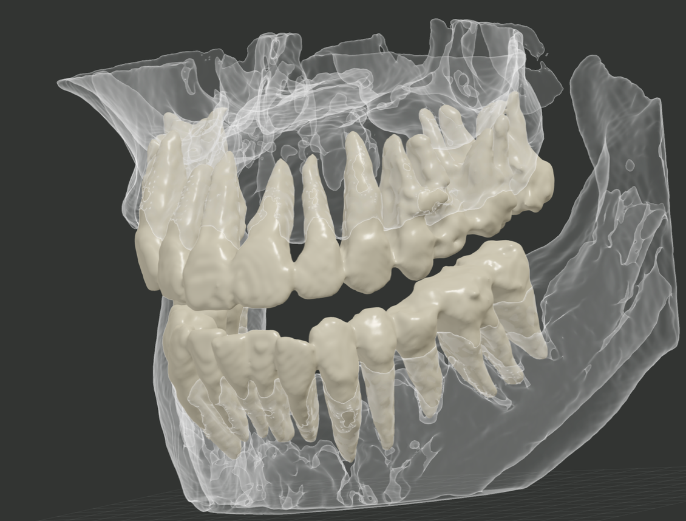

# TotalSegmentator Wrapper for Mac

Apple Silicon搭載Macで、CTから顎骨や歯の3Dデータを作成するための無料アプリです。
初回準備から処理、3D確認、STL保存までを、ひとつのアプリで進められます。

> 本アプリは研究・教育・検証用です。医療機器ではなく、生成結果は診断には使用できません。

[製品ページ](https://totalsegmentator.lacramy.com/) ·
[ダウンロード](https://totalsegmentator.lacramy.com/download) ·
[日本語マニュアル](docs/USER_MANUAL_JA.md) ·
[不具合・互換性を相談（Googleフォーム・ログイン不要）](https://forms.gle/QFPwF1Pi5C8bmSuw6)

## 主な特徴

- **かんたんセットアップ** — 専門的なコマンドを入力せず、アプリ内のボタンひとつで初回準備を進めます。
- **サンプルですぐ試せる** — 手元にCTがなくても、付属サンプルで操作の流れを確認できます。
- **MacのGPUを活用** — Apple Silicon搭載MacのGPUを使って処理します。
- **目的に合わせて選べる** — 全体を短時間で確認する方法、顎骨・歯・下顎管を分ける方法、歯を一本ずつ検出する方法を利用できます。
- **ローカル処理** — 選択したDICOM、CT、処理結果、生成した3Dデータをアプリから外部へ送信しません。
- **読めないDICOMも相談可能** — エラー情報をコピーして報告できます。患者情報やDICOMファイル自体は送らないでください。

## 動作環境

- Apple Silicon（M1以降）搭載Mac
- macOS 14以降
- 初回準備とモデル取得のためのインターネット接続
- 十分な空き容量

Intel搭載Mac、Windows、Linux向けの配布アプリはありません。

## 使い方

1. [製品ページ](https://totalsegmentator.lacramy.com/)からDMGをダウンロードします。
2. DMGを開き、アプリを`Applications`へコピーします。
3. アプリを起動し、画面の案内に沿って初回準備を行います。
4. まず付属サンプルで操作を確認します。
5. `自分のCTを開く`からDICOMフォルダまたはNIfTIファイルを選びます。
6. 処理方法を選び、結果を3Dで確認してSTLを保存します。

詳しい画面操作と失敗時の戻り方は
[日本語ユーザーマニュアル](docs/USER_MANUAL_JA.md)を参照してください。

## 利用できる処理

| 表示名 | 主な用途 | 利用する公開プロジェクト |
| --- | --- | --- |
| TotalSegmentator | 顎骨と歯の全体像を短時間で確認 | [TotalSegmentator](https://github.com/wasserth/TotalSegmentator) |
| DentalSegmentator | 顎骨、上下の歯、下顎管などを分けて確認 | [DentalSegmentator](https://github.com/gaudot/SlicerDentalSegmentator) |
| ToothSeg | 歯を一本ずつ検出して確認 | [ToothSeg](https://github.com/MIC-DKFZ/ToothSeg) |

### 口腔内スキャン（0.4.1）

0.4.1では、口腔内スキャンのPLY／STLから歯別STLを作成できます。

- MeshSegNetでは、アプリに同梱されるのは実装のみです。重み（Apache-2.0）は
  口腔内スキャン機能の初回使用時に固定配布元から取得し、SHA-256を検証します。
- TGNetの重みは指定の配布ページから利用者が取得するもので、アプリには同梱されません。
  ライセンスは本アプリでは未確認です。配布ページ:
  <https://drive.google.com/drive/folders/15oP0CZM_O_-Bir18VbSM8wRUEzoyLXby?usp=sharing>
- 歯別STLに加えて`gingiva.stl`が作られることがあります。TGNetでは歯肉、
  MeshSegNetの`gingiva.stl`は背景を含む候補のため、目視確認が必要です。

本リポジトリはTotalSegmentatorの公式アプリではありません。各プロジェクトの
名称は、利用している技術と由来を示すために記載しています。

## データの扱い

- 元のDICOMを書き換えません。
- DICOMやCTの画像処理はMac内で行います。
- DICOM、CT、ログ、処理結果、生成した3Dデータを自動送信しません。
- 更新確認は利用者が`更新を確認`を押したときだけ行います。
- 不具合報告には患者名などの個人情報やDICOMファイルを添付しないでください。

## オープンソースとライセンス

本プロジェクトが独自に作成したPython、Swift、C++コード、ドキュメント、
および第一者リソースは[Apache License 2.0](LICENSE)で公開しています。
適用範囲の詳細は[NOTICE](NOTICE)を参照してください。

第三者コード、別途取得するモデル、サンプルデータ、モデルから生成した
サンプル成果物、第三者の名称・商標は、本プロジェクトのApache-2.0へ
再ライセンスされません。

- TotalSegmentatorのコードはApache-2.0です。本アプリが利用するモデルの条件は
  各タスクの上流条件に従います。
- DentalSegmentatorとToothSegの学習済みモデルは初回利用時に別途取得し、
  CC BY 4.0の条件が適用されます。
- dcm2niix、DICOM関連ライブラリ、Pythonランタイムと依存パッケージには、
  それぞれのライセンスが適用されます。

配布アプリには`LICENSE`、`NOTICE`、第三者ライセンス一覧を同梱しています。
アプリのメニューから各文書を開くこともできます。監査内容は
[Open Source License Audit](docs/41_OPEN_SOURCE_LICENSE_AUDIT.md)に記録しています。

## 開発に参加する

不具合報告、DICOM互換性の報告、改善提案、Pull Requestを歓迎します。
最初に[CONTRIBUTING.md](CONTRIBUTING.md)をお読みください。

患者情報を含むデータやログは、GitHub IssueやPull Requestへ投稿しないでください。
セキュリティ上の問題は[SECURITY.md](SECURITY.md)の方法で連絡してください。

ローカルでのテストや配布物の作成方法は
[開発者向けドキュメント](docs/00_AGENT_DIRECTIVE.md)から辿れます。

## 無保証

本ソフトウェアはApache License 2.0に基づき、無保証で提供されます。
生成結果の正確性、完全性、特定目的への適合性を保証するものではありません。
