# TotalSegmentator Wrapper for Mac 日本語ユーザーマニュアル

> 本アプリは研究・教育・検証用です。医療機器ではなく、生成結果は診断には使用できません。
> 対応環境はApple Silicon搭載Mac、macOS 14以降です。

<!--
Manual maintenance metadata
- reviewed_at: 2026-07-31
- reviewed_app_version: 0.4.1
- ui_sources:
  - native/macos/TotalSegmentatorWrapperForMac/Views.swift
  - native/macos/TotalSegmentatorWrapperForMac/AppState.swift
- screenshot_manifest: docs/assets/user-manual/README.md
-->

このマニュアルでは、画面に表示される名前と同じ言葉を使って操作を説明します。

初めて使う場合は、まずSampleで一連の流れを試してください。

1. `Sampleから始める`を押す
2. `Sampleで3Dプレビューを作る`を押す
3. 処理が終わるまで待つ
4. `3Dプレビューを開く`を押す

## 目次

1. [このアプリでできること](#1-このアプリでできること)
2. [初回準備](#2-初回準備)
3. [Sampleで操作を試す](#3-sampleで操作を試す)
4. [手元のCTを選ぶ](#4-手元のctを選ぶ)
5. [通常DICOM／NIfTIの操作](#5-通常dicomniftiの操作)
6. [寸法情報がないCTの「形状を確認」画面](#6-寸法情報がないctの形状を確認画面)
7. [3Dプレビュー作成中の画面](#7-3dプレビュー作成中の画面)
8. [結果の確認と保存](#8-結果の確認と保存)
9. [ToothSegなどの追加機能](#9-toothsegなどの追加機能)
10. [口腔内スキャン](#10-口腔内スキャン)
11. [失敗時の対処](#11-失敗時の対処)
12. [データの扱い](#12-データの扱い)
13. [ライセンスとバグ報告](#13-ライセンスとバグ報告)

## 1. このアプリでできること

このアプリは、CTデータから歯列・顎骨などの3Dプレビューを作成します。

入力として選べるものは次の2種類です。

- DICOMファイルが入った撮影フォルダ、または1つにまとまったDICOMファイル
- NIfTI形式のCTファイル（`.nii`または`.nii.gz`）

作成後は、3Dプレビューをブラウザで開いたり、結果フォルダをFinderで確認したりできます。

画面左側には、現在の段階が表示されます。

- 目的：Sampleまたは手元のCTを選ぶ
- 入力：使用するCTと作成内容を確認する
- 実行：3Dプレビューを作成する
- 結果：3Dプレビューと保存ファイルを確認する

## 2. 初回準備

初めて起動したときや、必要な機能が更新されたときは、`はじめの準備`画面が表示されます。

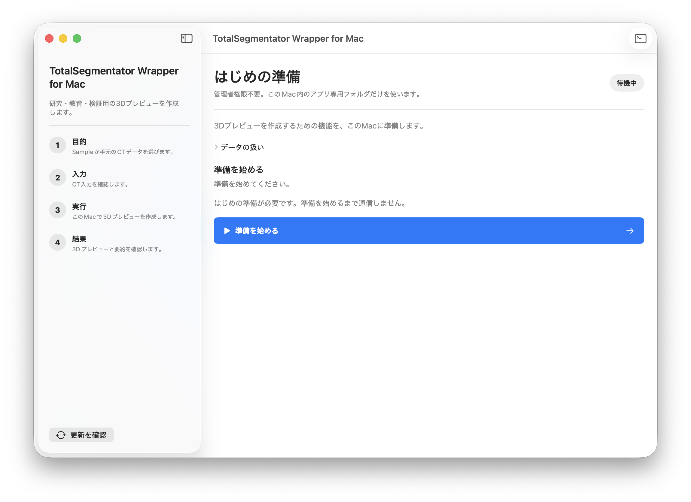

### 準備を始める

1. `準備を始める`を押します。
2. 画面に表示される現在の作業と経過時間を確認します。
3. 準備が終わるまで、アプリを閉じずに待ちます。

Python依存はセットアップ中に完成済みbinary wheelをネットワークから取得します。
利用者のMacでsource buildは行わず、XcodeやCommand Line Toolsも必要ありません。依存パッケージとモデルは合わせて数百MB以上になるため、
通信環境によっては数十分かかることがあります。取得量が分かる工程では、
画面に取得済み容量、割合、残り時間の目安が表示されます。100%になった後も、完全性の
確認や展開を続けるため、完了表示へ切り替わるまでお待ちください。

通信が切れたりアプリを終了したりした場合は、もう一度`準備を始める`を押してください。
中断したモデル取得は、配布サーバーが再開に対応していれば保存済み位置から再開します。
再開に対応しない場合も、不完全なデータを継ぎ足さず、そのモデルだけを先頭から安全に
取得し直します。完全に取得済みのモデルは再取得しません。
通信が2分間まったく進まない場合は、その試行をエラーとして終了します。不完全な取得
データは再開用に保持されるため、接続を確認して同じボタンを押すと続きから再試行できます。

### 準備できなかった場合

画面に表示された理由を確認します。詳しい情報が必要な場合は、画面右上の`詳細ログ`を押してください。

通信に関する案内が表示された場合は、インターネット接続を確認してから`準備を始める`をもう一度押します。

## 3. Sampleで操作を試す

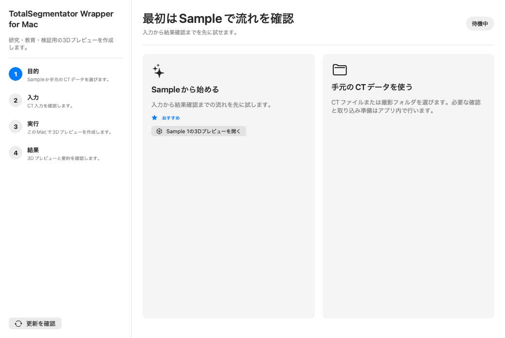

### 2つのSample操作の違い

開始画面には、目的の異なる2つの操作があります。

- `Sampleから始める`：Sampleを使って、作成開始から結果確認までを試す
- `Sample 1の3Dプレビューを開く`：作成処理を行わず、同梱済みの3D表示だけを見る

初めて操作を試す場合は、`Sampleから始める`を押します。

### Sampleで新しく作成する

1. `Sampleから始める`を押します。
2. 入力欄が`Sample 1`になっていることを確認します。
3. `標準モデル`が選ばれていることを確認します。
4. `Sampleで3Dプレビューを作る`を押します。

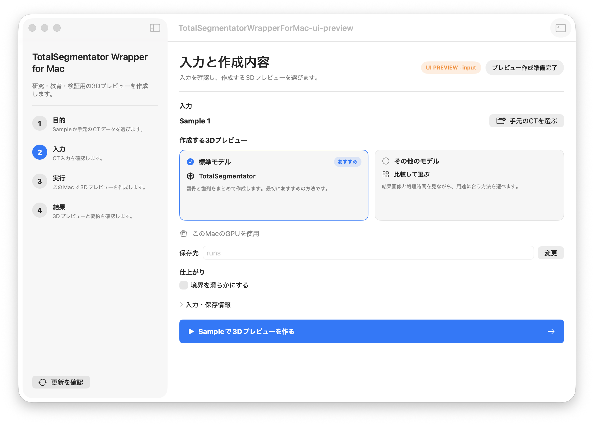

通常は、`標準モデル`のままで進めます。`その他のモデル`については、[ToothSegなどの追加機能](#9-toothsegなどの追加機能)を参照してください。

保存先を変更する場合は、保存先の右にある`変更`を押します。

## 4. 手元のCTを選ぶ

### CTデータを選択する

1. 開始画面で`手元のCTデータを使う`を押します。
2. `CTデータを選ぶ`を押します。
3. CTファイルまたは撮影フォルダを1つ選びます。

`.nii`または`.nii.gz`ファイルを選んだ場合は、NIfTI形式のCTとして取り込みます。それ以外のCTファイル、またはフォルダを選んだ場合は、DICOMとして内容を確認します。

選択後の動きはデータによって異なります。

- 通常のCT：取り込み後、`入力と作成内容`画面へ進む
- 使用できる撮影が複数ある：最初の候補を選んだ状態で進む
- 形の比率を判断する情報がない：`形状を確認`画面へ進む
- CT閲覧ソフトから書き出した断面画像の可能性がある：`CT画像を確認`画面へ進む
- 安全に取り込めない：理由を表示して停止する

### 選び直す

入力画面で`手元のCTを選ぶ`または`別のCTを選ぶ`を押します。現在の入力を誤って処理しないよう、新しいデータを選び終わるまで作成は始まりません。

## 5. 通常DICOM／NIfTIの操作

### 通常のDICOMフォルダ／単一DICOMファイル

DICOMフォルダ、または複数断面が1つにまとまったDICOMファイルを選ぶと、アプリは撮影データの構成を確認し、3D作成用のCTを準備します。

使用できる撮影が1つの場合は、その撮影を準備します。使用できる撮影が複数ある場合は、最初の候補が選ばれます。

別の撮影を使いたい場合だけ、`使用する撮影`の横にある`変更`を押してください。

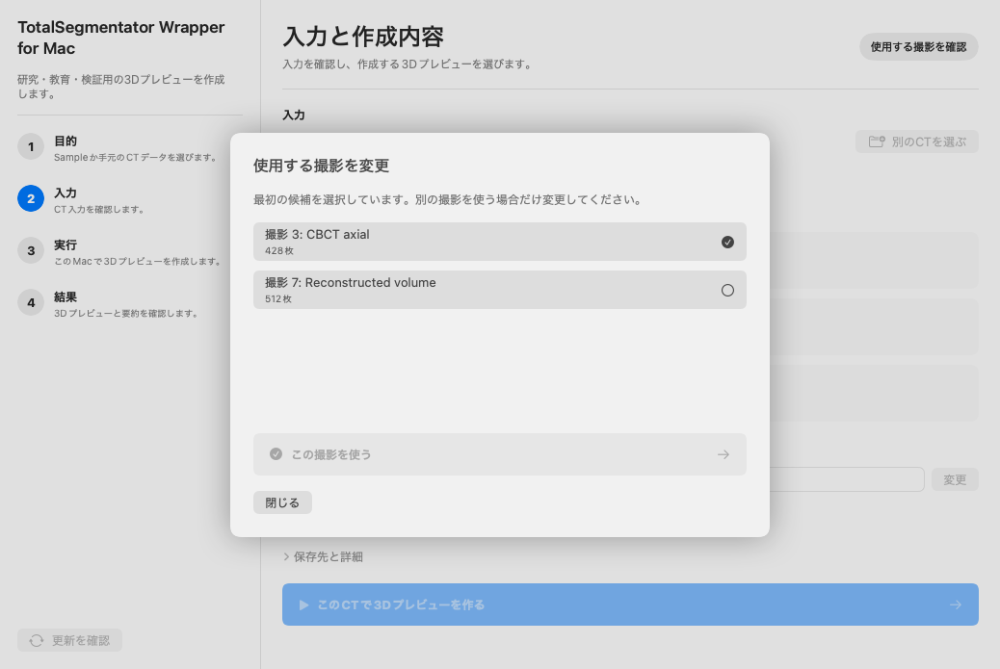

1. 一覧から使用する撮影を選びます。
2. `この撮影を使う`を押します。
3. 入力画面へ戻ったら、表示された撮影名を確認します。

どれを選ぶか分からない場合は、最初に選ばれている候補のまま進むか、撮影元のCT閲覧ソフトで内容を確認してください。

### NIfTIファイル

NIfTIファイルを選ぶと、`入力と作成内容`画面へ戻ります。

1. 入力欄に選んだファイル名が表示されていることを確認します。
2. 作成する3Dプレビューを確認します。
3. `このCTで3Dプレビューを作る`を押します。

### 「CT画像を確認」が表示された場合

CT閲覧ソフトから、表示用の断面画像として書き出された可能性があるデータでは、3方向の画像が表示されます。

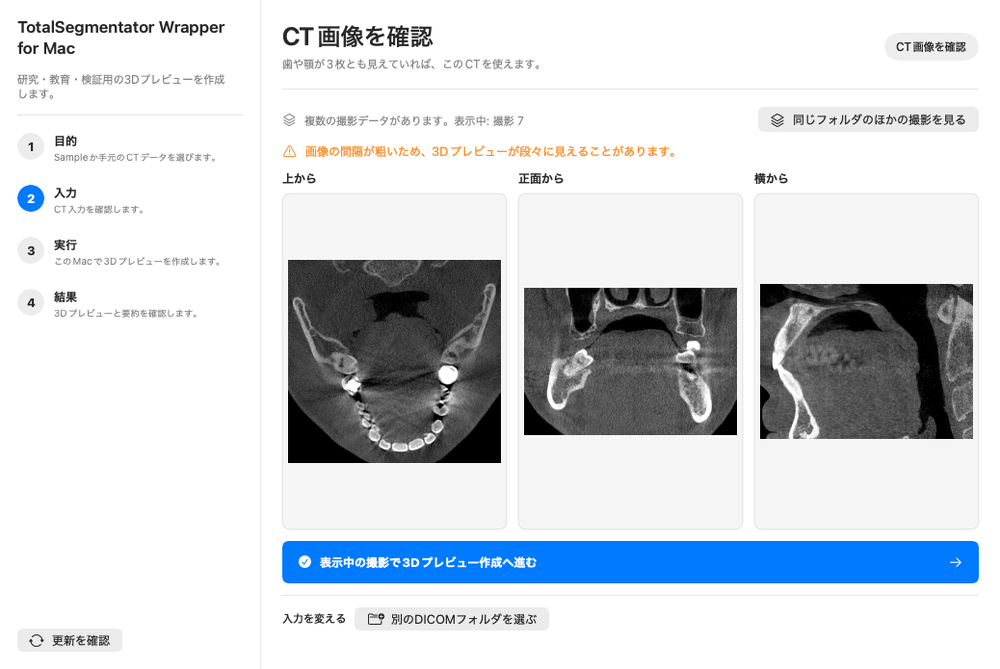

1. `上から`、`正面から`、`横から`の3枚を確認します。
2. 歯や顎など、確認したい範囲が3枚に写っていることを確かめます。
3. 問題がなければ、`表示中の撮影で3Dプレビュー作成へ進む`を押します。
4. 入力画面へ戻ったら、`このCTで3Dプレビューを作る`を押します。

同じフォルダに別の撮影がある場合は、`同じフォルダのほかの撮影を見る`を使えます。別のフォルダを選ぶ場合は、`別のDICOMフォルダを選ぶ`を押します。

警告が表示されている場合は、3Dが段々に見えるなど、元の断面画像の特徴が結果に残ることがあります。

## 6. 寸法情報がないCTの「形状を確認」画面

DICOMに形の比率を判断するための情報が十分にない場合は、作成前に`形状を確認`画面が表示されます。

この画面では、上・正面・横に相当する3方向の画像を見比べます。画面上では`AXIAL`、`CORONAL`、`SAGITTAL`と表示されます。

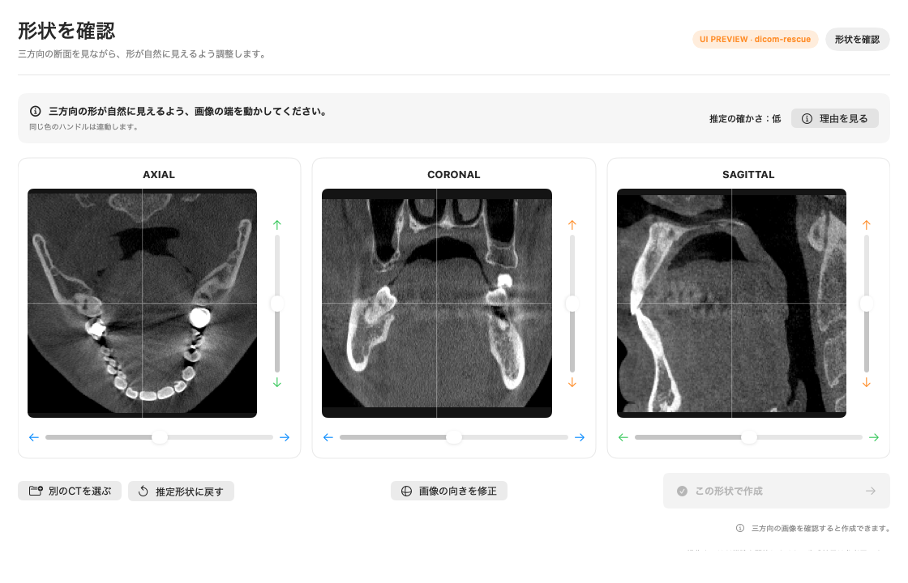

### 最初に確認する場所

- 3方向とも画像が表示されている
- 歯や顎の形が極端につぶれたり、引き伸ばされたりしていない
- 上下や左右が明らかに逆になっていない
- 画像の更新中ではない

`推定の確かさ`は、アプリが作った最初の候補についての表示です。`理由を見る`を押すと、その候補を作るために使った情報を確認できます。

### 形を調整する

1. 各画像の端にある色付きのハンドルを動かします。
2. 3方向の画像が更新されるまで待ちます。
3. 形が自然に見えるか、3方向をもう一度確認します。
4. 調整をやり直す場合は、`推定形状に戻す`を押します。

同じ色のハンドルは連動します。1枚だけで判断せず、3枚を行き来して確認してください。

### 画像の向きを直す

画像が明らかに回転している、または断面の順番が逆に見える場合だけ、`画像の向きを修正`を押します。

- `90°回転`：画像を90度回す
- `スライス順を反転`：断面の並び順を逆にする
- `軸の対応`：3方向の割り当てを変更する

変更後は画像の更新が終わるまで待ちます。

### 作成へ進む

3方向の形と向きを確認したら、`この形状で作成`を押します。確認した形が適用され、そのまま3Dプレビュー作成が始まります。

ボタンを押せない場合は、画面右下の案内を確認してください。

- 画像を更新中：更新が終わるまで待つ
- 三方向の画像を確認できない：`別のCTを選ぶ`
- 画像の更新に失敗：`推定形状に戻す`を試し、改善しなければ別のCTを選ぶ

## 7. 3Dプレビュー作成中の画面

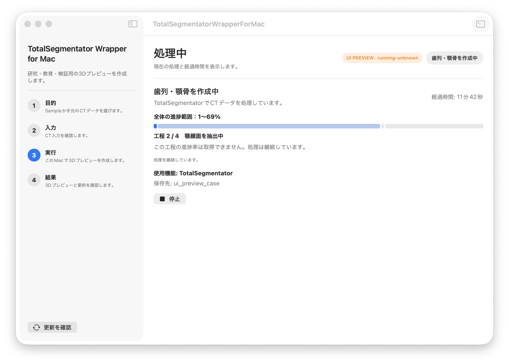

処理中は、次の情報が表示されます。

- 現在の工程
- 全体のおおよその進行範囲
- 分かる場合は、その工程の進み具合と残り時間の目安
- 経過時間
- 使用中の機能
- 保存先

進行表示は目安です。工程によっては正確な割合を取得できないため、範囲で表示されたり、しばらく数字が変わらなかったりします。`処理を継続しています`と表示されている間は、そのまま待ちます。

### 処理を止める

`停止`を押します。`停止要求済み。終了処理中です。`と表示されたら、終了画面へ切り替わるまで待ってください。

## 8. 結果の確認と保存

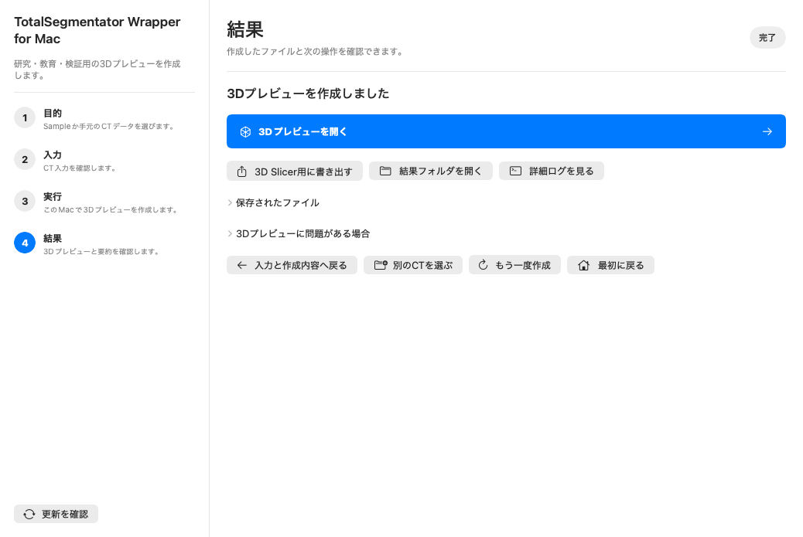

### 3Dプレビューを開く

`3Dプレビューを開く`を押します。Macの標準ブラウザで、保存された3Dプレビューが開きます。

表示にインターネット接続は必要ありません。ブラウザで開きますが、表示するファイルはこのMac内にあります。

開いた直後に`3Dデータを読み込んでいます`と表示された場合は、そのまま待ちます。データ量によって表示まで時間がかかることがあります。読み込みが完了すると、案内は自動的に消えます。

### 保存された結果を確認する

- `結果フォルダを開く`：Finderで結果を確認する
- `保存されたファイル`：アプリ画面内で主な保存ファイルを確認する
- `詳細ログを見る`：処理の記録を確認する

詳細ログでは、次の操作ができます。

- `ログをコピー`
- `ログファイルを開く`
- `Finderで表示`
- `閉じる`

`ログをコピー`はローカルでの原因確認用です。詳細ログにはローカルパスや入力ファイル名が含まれる場合があるため、相談フォームには貼り付けないでください。フォームには失敗画面または詳細ログ画面の`エラー情報をコピー`を使用します。

### 3D Slicerで確認する

`3D Slicer用に書き出す`を押すと、3D Slicerで開けるファイルを結果フォルダに作成します。

書き出し後は3D Slicerを手動で開き、案内されたファイルを読み込んでください。

### 作り直す

- `もう一度作成`：同じ入力と作成内容で再実行する
- `入力と作成内容へ戻る`：設定を見直す
- `別のCTを選ぶ`：別の入力へ変更する
- `別の撮影で作り直す`：同じDICOMフォルダ内の別撮影を使う
- `最初に戻る`：開始画面へ戻る

`3Dプレビューに問題がある場合`を開くと、保存済みの処理結果から`3Dプレビューを再生成`できる場合があります。

## 9. ToothSegなどの追加機能

入力画面で`その他のモデル`を押すと、作成方法を比較できます。

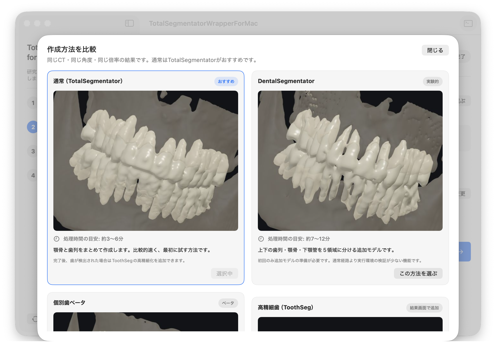

### 作成方法

- `通常（TotalSegmentator）`：歯列と顎骨をまとめて作成する。最初に試す方法
- `DentalSegmentator`：上下の歯列、顎骨、下顎管を複数の領域に分ける実験的な機能
- `個別歯ベータ`：歯を1本ずつ分けて表示するベータ機能
- `高精細歯（ToothSeg）`：通常の作成が終わったあと、結果画面から追加する機能

比較画面の処理時間は目安です。CTの範囲や解像度、Macの状態によって変わります。

### 追加データを準備する

DentalSegmentatorなどを初めて選ぶと、追加データを取得する前に確認画面が表示されます。

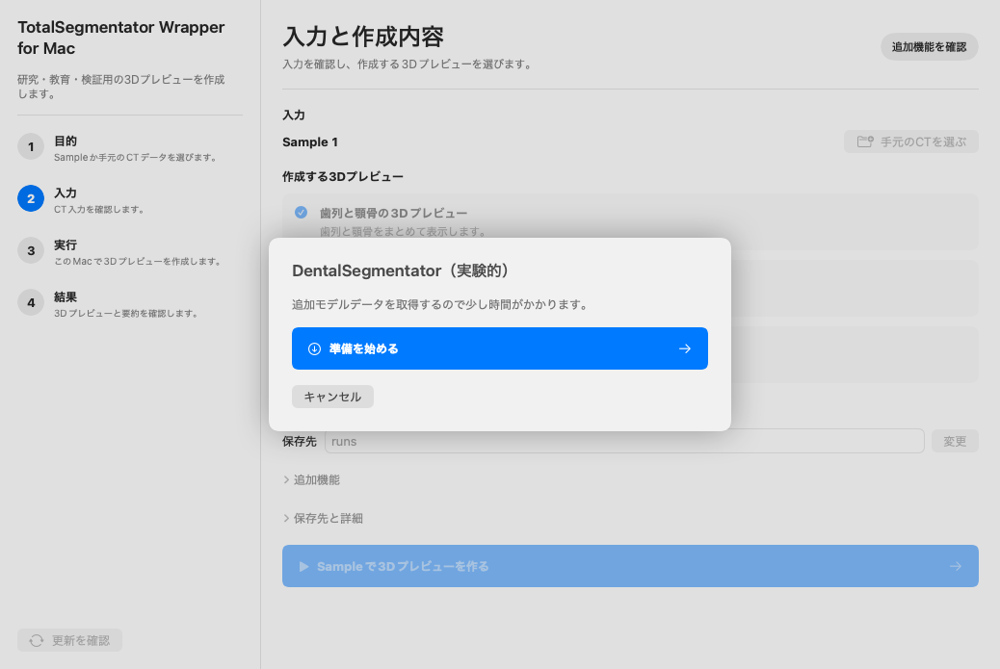

使う場合は`準備を始める`を押します。使わない場合は`キャンセル`を押します。

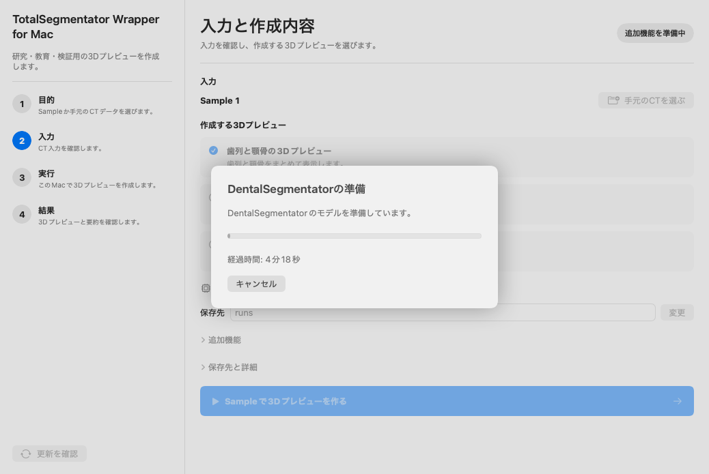

準備をキャンセルしても、別の機能で作成が自動的に始まることはありません。

### ToothSegを追加する

通常の3Dプレビュー作成で歯が検出された場合、結果画面に`高精細歯分割（ToothSeg）を実行`が表示されます。

1. `高精細歯分割（ToothSeg）を実行`を押します。
2. 初回だけ追加データの準備を確認します。
3. 処理が終わるまで待ちます。
4. 結果画面の`結果表示対象`で、元の結果とToothSegの結果を切り替えます。

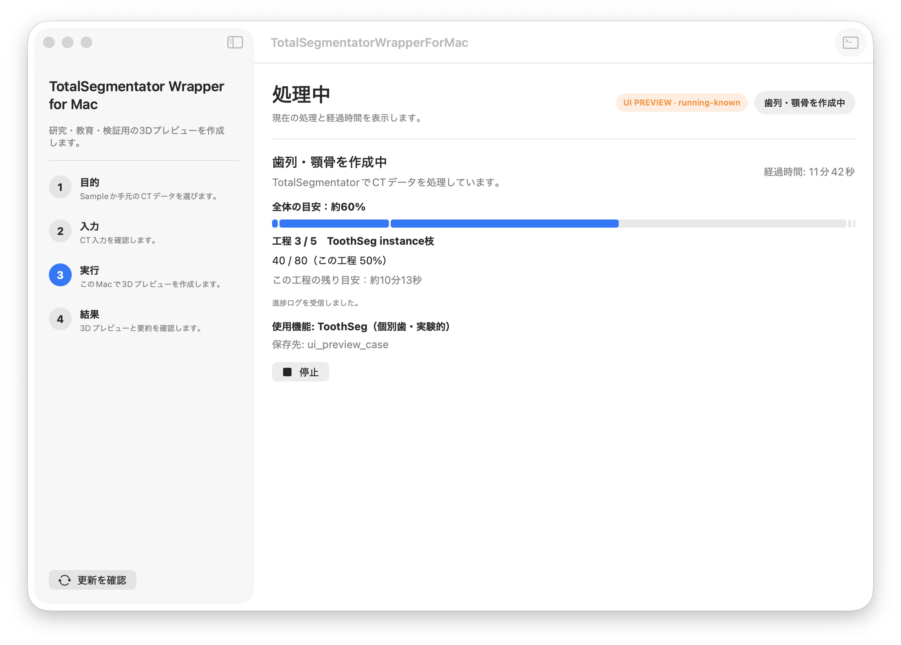

ToothSegだけが失敗した場合も、先に作成した歯列・顎骨の結果は利用できます。`ToothSegを再実行`するか、元の結果を開いてください。

## 10. 口腔内スキャン

開始画面の`口腔内スキャンを使う`では、口腔内スキャンの三角形メッシュ
（PLYまたはSTL）から歯別STLを作成できます。現在は研究・教育・検証用
です。処理前に画面で顎を選択します。

画面では`同梱モデル（MeshSegNet）を使用する`と
`TGNet用ZIP／フォルダを選ぶ`を同じ階層から選べます。
アプリに同梱されるのは実装です。重み（Apache-2.0）は口腔内スキャン機能の初回実行時に固定配布元から取得し、SHA-256を検証します。重みはアプリ／DMGには同梱しません。
TGNetは`TGNet（重みは別途取得）`と表示されます。
TGNetの著者READMEが案内しているcheckpoint配布ページは
`https://drive.google.com/drive/folders/15oP0CZM_O_-Bir18VbSM8wRUEzoyLXby?usp=sharing`
です。アプリはこのページをブラウザで開くだけで、重みを自動ダウンロードしません。
配布ページでは約149.6 MBの`ckpts(new).zip`を選びます。アプリの
`TGNet用ZIP／フォルダを選ぶ`では、このZIPを展開せずそのまま選択できます。
実行時に必要な`tgnet_fps.h5`と`tgnet_bdl.h5`だけを一時展開し、
ファイル名とSHA-256を検証します。ZIP内の比較用モデルは読み込みません。
SafariなどがZIPを自動展開した場合は、展開後の`ckpts(new)`フォルダを
そのまま選択できます。配下のフォルダを個別に探す必要はありません。
TGNetでは、`ckpts(new).zip`を選ぶか、必要な2個の
checkpointを含むフォルダ自体を選択します。2個のファイル名、SHA-256、
モデル内のkey・shape・クラス数が既知の構成と完全一致しない場合は
実行しません。指定外のZIP、フォルダ、単一checkpointは画面から選択
できません。

TGNetを選択すると、画面には`ライセンス：未確認`と表示されます。
TGNetの重みは本アプリに同梱されていません。利用する場合は、指定の
配布ページからご自身で取得し、配布元が示す利用条件をご確認ください。
SHA-256と形式検査結果は結果JSONに記録されます。
TGNetでは、選択した顎に合わせて入力向きをアプリ側で自動調整します。

1. `口腔内スキャンを使う`を押します。
2. `上顎`または`下顎`を選びます。
3. `PLY/STLを選ぶ`で、選択した顎のメッシュを選びます。
4. `同梱モデル（MeshSegNet）を使用する`または`TGNet用ZIP／フォルダを選ぶ`を選びます。TGNetでは取得した`ckpts(new).zip`、またはその展開済みフォルダを使用できます。
5. TGNetでは`TGNetの重みを確認しました`と表示されたことと、ライセンス情報を確認します。
6. `MPSで歯別STLを作成`を押します。
7. 完了後に`出力フォルダを開く`で、歯別STLと結果JSONを確認します。

結果rootには、歯別ファイルとは別に`gingiva.stl`が作成されることがあります。
TGNetでは歯肉、MeshSegNetではlabel 0由来の`歯肉または背景候補`です。
MeshSegNetの候補には背景が含まれる可能性があるため、必ず目視確認してください。
label 0がない結果では`gingiva.stl`を作成しません。歯数表示と`teeth_stl/`
以下の歯別STLは従来どおりで、`gingiva.stl`を歯数には含めません。

口腔内スキャン機能は研究・教育・検証用です。診断・治療には使用しない
でください。

## 11. 失敗時の対処

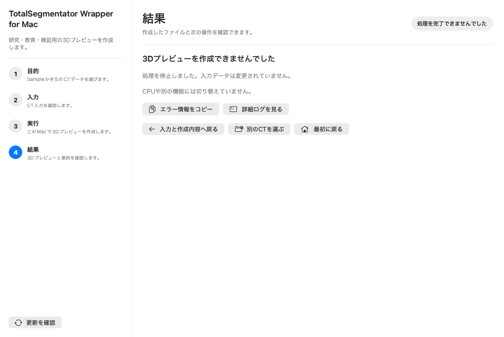

まず、画面に表示された理由を読みます。そのあと、次の表から近い状況を確認してください。

| 状況 | 次に行うこと |
| --- | --- |
| 初回準備を完了できない | 通信状態と画面の案内を確認し、`詳細ログ`を開く |
| CTを取り込めない | `別のCTを選ぶ`を試し、必要なら`詳細ログを見る` |
| `形状を確認`から進めない | 画像更新を待つ。改善しなければ`推定形状に戻す`または`別のCTを選ぶ` |
| 3方向のCT画像を確認できない | 同じフォルダの別撮影を見るか、別のDICOMフォルダを選ぶ |
| 作成処理に失敗した | `エラー情報をコピー`し、`詳細ログを見る` |
| 3Dプレビューだけ作れない | 結果が保存されていれば`3Dプレビューを再生成` |
| ToothSegだけ失敗した | 元の歯列・顎骨結果を使うか、`ToothSegを再実行` |

### サポートへ伝える情報

1. `エラー情報をコピー`を押します。
2. 必要に応じて`詳細ログを見る`を開きます。
3. 使用したCT閲覧・書き出しソフトの名前を控えます。

詳細ログの`ログをコピー`はローカルでの確認用です。詳細ログにはローカルパスや入力ファイル名が含まれる場合があるため、相談フォームには貼り付けず、`エラー情報をコピー`で作成した内容だけを使用してください。

患者名、患者ID、CTの画像、ローカルファイルの場所は、送る前に含まれていないことを確認してください。

## 12. データの扱い

### 保存場所

入力から作成した中間データ、結果、ログは、このMacのアプリ専用フォルダまたは自分で選んだ保存先に保存されます。

元のDICOMファイルは変更しません。DICOMフォルダから作成に必要なデータを別の場所へ準備します。

### インターネット通信

次の場合は、インターネット通信が発生することがあります。

- 初回準備で必要な機能を取得するとき
- DentalSegmentatorやToothSegの追加データを取得するとき
- 自分で`更新を確認`を押したとき

これらの通信で、DICOM、CT、処理結果、ログ、ローカルファイルの場所を送信しません。

### 画面やログを共有するとき

- 実患者のCT画像をスクリーンショットに含めない
- 患者名、患者ID、施設名、撮影日時が写っていないか確認する
- ログにローカルファイルの場所が含まれる可能性を考慮する
- マニュアル用画像にはSampleまたはDEBUG用画面だけを使う

## 13. ライセンスとバグ報告

アプリ本体は無料のオープンソースソフトウェアで、Apache License 2.0
により無保証で提供されます。アプリ内の`Contents/Resources/LICENSE`
と`NOTICE`で本文と適用範囲を確認できます。

TotalSegmentator、DentalSegmentator、ToothSeg、MeshSegNet、
利用者が指定の配布ページから別途取得するTGNetの重み、dcm2niix、Python依存物、
Sample 1、Sampleやモデルから作られた画像にはそれぞれ別の条件が
適用されます。第三者のライセンスと帰属表示は
`Contents/Resources/licenses/`と`THIRD_PARTY_NOTICES.txt`にあります。

初回セットアップに失敗した場合は準備画面の`エラー情報をコピー`と
`エラー報告フォームを開く`を使用できます。推論に失敗した場合も、結果画面で
安全な診断情報をコピーして同じ報告フォームを開けます。アプリは、患者情報、
ローカルパス、生の詳細ログを含めないよう項目を限定した診断情報を
クリップボードへコピーし、既存のGoogle相談フォーム
（`https://forms.gle/QFPwF1Pi5C8bmSuw6`）をブラウザで開きます。
Googleアカウントへのログインは必須ではありません。
診断情報、ログ、患者データは自動送信されません。貼り付け前に内容を確認し、
患者データ、DICOM、CT画像、患者識別情報、ローカルパス、生の詳細ログは
添付しないでください。

<!--
Maintenance checklist
- Validate every button name against Views.swift.
- Validate every route and automatic transition against AppState.swift.
- Re-capture DEBUG scenarios after UI changes:
  setup, start, input, input-advanced, input-comparison,
  running, running-known, running-unknown, running-download, running-stopped,
  ct-preview, dicom-rescue, dicom-rescue-updating,
  result, result-toothseg, result-toothseg-failure, result-failure.
- Keep the single public notice at the top; do not repeat it in each chapter.
- Do not add screenshots made from patient data.
-->
